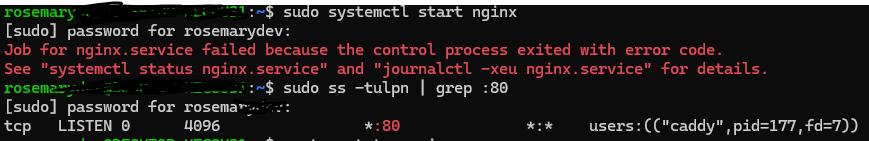
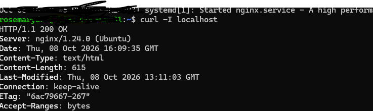

# Incident 01: Nginx Fails to Start — Port 80 Conflict

## Ticket Details

- Ticket ID: INC-001
- Category: Linux / Web Server Troubleshooting
- Severity: High (website unavailable)
- Status: Resolved

## 1. Customer Report

«Hello support team, the website is down and I can't access it. Could you please fix this quickly? Thank you!»

## 2. Symptoms

- During installation, the output showed:
```text
Not attempting to start NGINX, port 80 is already in use.
```

- Running "sudo systemctl start nginx" failed with:
```text

Job for nginx.service failed because the control process exited with error code.
See "sysytemctl status nginx.service" and "journalctl -xeu nginx.service" for details.

```

## 3. Investigation and Diagnosis

Step 1: Reproduced the issue
```bash
sudo systemctl start nginx
```
Finding: Nginx failed to start.

Step 2: Identified the process listening on port 80

```bash
sudo ss -tulpn | grep :80
```

Finding: The output identified Caddy as the process using port 80.



Step 3: Checked the Caddy service

```bash
systemctl status caddy
```
Finding: Caddy was running as a system service.

## 4. Root Cause

Caddy, left over from an earlier project, was running and occupying port 80. Nginx could not bind to the same address and port, so its startup failed.

## 5. Resolution

After confirming that Caddy was no longer needed on this machine, I stopped and disabled it.

```bash
sudo systemctl stop caddy
sudo systemctl disable caddy
sudo systemctl start nginx
```

- "stop" stops the running service.
- "disable" prevents the service from starting automatically at boot.
- "start" starts Nginx.

## 6. Verification

Confirmed that Nginx was running

```bash
systemctl status nginx
```

Result: "active (running)".

Confirmed that Nginx served HTTP successfully

```bash
curl -I localhost
```

Result: "HTTP/1.1 200 OK", served by Nginx/1.24.0.



This confirmed that Nginx was responding successfully to a local HTTP request.

Confirmed that Caddy was disabled

```bash
systemctl is-enabled caddy
```

Result: "disabled".

## 7. Prevention

- Check which processes are listening on required ports before installing or starting web servers.
- Document which service is responsible for each port.
- Disable unused services only after confirming that no applications depend on them.
- If both Caddy and Nginx are required, configure an appropriate reverse-proxy arrangement or separate ports, depending on the architecture.

## 8. Lessons Learned

A web server startup failure may be caused by a port conflict rather than a faulty installation. Commands such as "ss", "systemctl status" and "curl" help identify the cause, check service health and verify the resolution.

## Skills Demonstrated

- Linux service management with systemd
- Port and process troubleshooting
- Web server diagnostics
- Root cause analysis
- Incident resolution and verification
- Technical documentation
